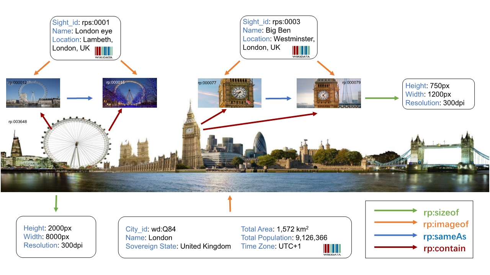

# Richpedia: A Comprehensive Multi-Modal Knowledge Graph

# Introduction

With the rapid development of Semantic Web technologies, various knowledge graphs are published on the Web using Resource Description Framework (RDF), such as Wikidata and DBpedia. Knowledge graphs provide for setting RDF
links among different entities, thereby forming a large heterogeneous graph, supporting semantic search, question answering and other intelligent services.
Meanwhile, public availability of visual resource collections has attracted much
attention for different Computer Vision (CV) research purposes, including visual
question answering, image classification, object and relationship detection, etc. And we have witnessed promising results by encoding entity and
relation information of textual knowledge graphs for CV tasks. Whereas most
knowledge graph construction work in the Semantic Web and Natural Language
Processing (NLP) communities still focus on organizing and discovering only textual knowledge in a structured representation. There is a relatively small amount of attention in utilizing visual resources for KG research. A visual database is
normally a rich source of image or video data and provides sufficient visual information about entities in KGs. Obviously, making link prediction and entity
alignment in wider scope can empower models to make better performance when
considering textual and visual features together.

As mentioned above, general knowledge graphs focus on the textual facts.
There is still no comprehensive multi-modal knowledge graph dataset prohibiting
further exploring textual and visual facts on either side. To fill this gap, we
provide a comprehensive multi-modal dataset (called **Richpedia**) in this paper, as shown in figure below.

In summary, our **Richpedia** data resource mainly makes the following contributions:
* To our best knowledge, we are the first to provide comprehensive visualrelational resources to general knowledge graphs. The result is a big and
high-quality multi-modal knowledge graph dataset, which provides a wider
data scope to the researchers from The Semantic Web and Computer Vision.
* We propose a novel framework to construct the multi-modal knowledge
graph. The process starts by collecting entities and images from Wikidata,
Wikipedia, and Search Engine respectively. Images are then filtered by a
diversity retrieval model. Finally, RDF links are set between image entities
based on the hyperlinks and descriptions in Wikipedia.
* We publish the Richpedia as an open resource, and provide a faceted query
endpoint using Apache Jena Fuseki1. Researchers can retrieve and leverage
data distributed over general KGs and image resources to answering more
richer visual queries and make multi-relational link predictions.

# Download

You can download images and triples of relationship from here through BaiduYun Drive. Because the image entity folder is relatively large, we split it into two parts(City&Sight, People) for download.
## Image
#### [City&Sight](https://pan.baidu.com/s/1lt-SmWUX5GAmLRNWggDkXQ)
#### [People](https://pan.baidu.com/s/1tUnmlA7Fb90pPZwhxy-jow#list/path=%2F)
## NT Files
#### [Triples](https://pan.baidu.com/s/1sndHDroLfx__f0mUjH1RGQ#list/path=%2F)
# Friendly Link
Our data uses other resources, so we make a statement here.
*   [Wikidata](https://www.wikidata.org/wiki/Wikidata:Main_Page) is becoming an increasingly important knowledge graph in the research community. We collect the KG entities from Wikidata as EKG in Richpedia.
*   [Wikipedia](https://www.wikipedia.org/) contains images for KG entities in Wikidata and a
number of related hyperlinks among these entities. We will collect part of the
image entities from Wikipedia and relations between collected KG entities
and image entities. We will also discover relations between image entities
based on the hyperlinks and related descriptions in Wikipedia.
*   [Google](https://www.google.com), [Yahoo](https://search.yahoo.com), [Bing](https://cn.bing.com/) image sources: To obtain sufficient image entities related to each KG entity, we implemented a web crawler taking input as KG entities to image search engines Google Images, Bing Images, and Yahoo Image Search, and parse query results.
# License

This work is licensed under a [Creative Commons Attribution 4.0 International License](http://creativecommons.org/licenses/by/4.0/)

# Contact

<li>Qiushuo Zheng <a href="mailto:qs_zheng@seu.edu.cn">qs_zheng@seu.edu.cn</a></li>

<li>Jianxiong Zheng <a href="mailto:2498973668@qq.com">zjx@seu.edu.cn</a></li>

<li>Guilin Qi <a href="mailto:gqi@seu.edu.cn">gqi@seu.edu.cn</a></li>
<li>Meng Wang <a href="mailto:meng.wang@seu.edu.cn">meng.wang@seu.edu.cn</a></li>

# Update

* ### V2.0

  Add images and triples of relationship.

# More information

[Github Pages](https://github.com/Mr-shuo/Richpedia_Website)

[website](http://richpedia.cn/)
